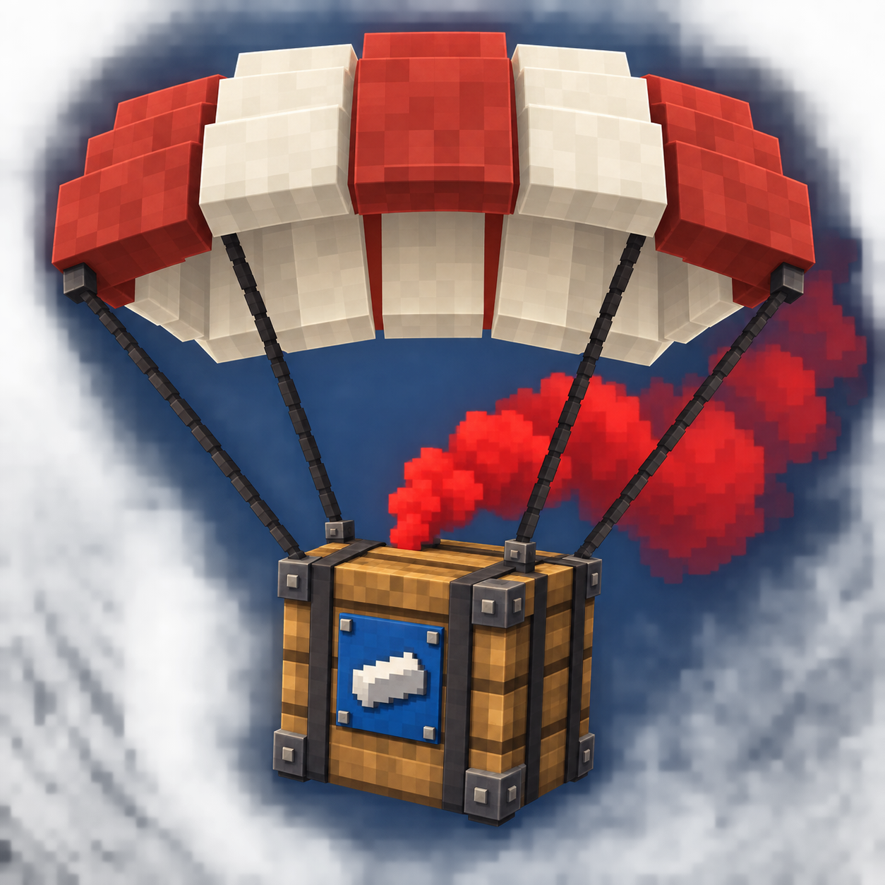

# Airdrop: Supply Drops



**Aircraft, parachutes, and supplies worth searching for.** Airdrop: Supply Drops brings timed supply deliveries to your Minecraft world, with a block-style aircraft, three bursts of flares, and parachute crates marked by smoke after landing.

## Finding airdrops

By default, a delivery is attempted every **20–30 minutes** in the **Overworld**. A living, non-spectator player is selected, and a safe landing point is sought **64–200 blocks horizontally** from that player's position when the event starts. The aircraft releases its cargo over this fixed point; it does not follow a moving player. Listen for the aircraft and follow the red smoke to find the delivery.

The aircraft appears 600 blocks before the landing point, flies at 20 blocks per second, and leaves 400 blocks beyond it. It flies 60 blocks above the landing point. At normal 20 TPS, it releases three bursts of flares at 24, 26, and 28 seconds, drops its cargo at 30 seconds, and leaves at 50 seconds. The parachute opens during descent; by default, smoke starts after landing. The server can change its color and enable smoke during descent. Drops can land above water, lava, and other fluids without replacing the fluid blocks. Visibility depends on client render distance and the server's loaded chunks.

Crates accelerate under gravity after release, slow as the parachute opens, then descend at a steady **2.4 blocks per second**. Client interpolation fills the movement between server updates; landing and cargo transfer remain server-controlled.

The aircraft has a tapered fuselage, six-pane wraparound cockpit glazing with fitted frames, swept wings, detailed engine nacelles and four-bladed propellers. Its 128×128 olive skin and blue-gray glass use repeating surface UVs, with panel seams, small rivets, subtle paint wear and restrained reflections. Exposed red and green navigation lights mark its wing tips, and a steady white tail light remains visible from below. White wing-tip and tail strobes flash twice every 1.5 seconds, with alternating red beacons above and below the fuselage. The lights use emission without directional shading and a soft circular glow so you can follow night deliveries from the ground.

Only one supply aircraft may be in flight across the server. Its departure at 50 seconds permits another event even if previous cargo is still descending or landed crates remain. An overdue automatic check waits for departure; if no suitable player, type or landing area is available, the scheduler retries after one minute.

## Collecting supplies

Two built-in supply types contain **vanilla items only**. Mineral crates offer coal, copper, iron, gold, and rare diamonds; food crates offer cooked meats and other food. Loot is randomized, with rarer rewards appearing less often and in smaller quantities. The default mineral table has a 1% legendary weight **per roll** and makes 8–14 rolls per crate. Each successful legendary roll awards one diamond; this is not a 1% chance per crate.

Right-click a landed crate to collect supplies from its **27-slot inventory**. You can take items out but cannot store your own items inside. Hoppers cannot insert or extract items. Mining a crate drops **four oak planks** plus any remaining supplies. Silk Touch and Fortune do not change the four-plank yield, and the crate cannot be obtained as an item or with pick-block.

Version 1.0.5 adds landed crates to TACZ's interact-key whitelist tag. With a compatible TACZ version installed, holding a gun and aiming at a crate enables its interaction prompt and configured interact key (normally **O**). See the [TACZ integration notes](INTEGRATION.md#tacz-interact-key-105) for version and validation details.

Landed crates and unclaimed supplies remain indefinitely, including after being emptied, after chunk unloading, and across restarts. A narrow smoke column rises above the crate to help locate it from a distance; particle lifetime and upward speed produce a plume roughly 20 blocks tall with a fading top. Smoke stops when the crate is emptied or **five minutes after landing**, whichever happens first; the crate and supplies remain. Smoke uses an absolute game-tick deadline, so unloading or restarting does not extend it, while pausing singleplayer pauses game time. Older saved crate expiration fields no longer delete crates.

## Customizing a modpack

Add your own supply types through datapacks, and use vanilla loot tables to choose items, weights, stack sizes, and independent reward probabilities. Custom tables can reference items from other installed mods. Type definitions support optional mod dependencies, automatic conditions for dimensions, biomes, weather, and time of day, and per-type landing distance and fluid landing settings.

Server configuration controls automatic intervals and allowed dimensions. In `<world>/serverconfig/airdrop_supply_drops-server.toml`, `interval_min_seconds = 1200` and `interval_max_seconds = 1800` give the default random 20–30-minute interval; set both to the same value for a fixed interval. Changing either value resets the pending check when the server config reloads. Resource packs can replace textures, sounds, and translations. Loot and settings are saved when a delivery starts, so `/reload` affects future drops without rerolling existing crates.

See the [modpack integration guide](INTEGRATION.md) and [example datapack](example_datapack). The example adds medical and survival supplies and is installed separately. Datapacks and configuration are the supported integration surface; there is currently no stable Java API or KubeJS event API. TACZ interaction support follows its whitelist contract; in-game behavior and other third-party integrations still need verification with the installed versions.

## Installation and versions

Install the matching **Forge** version, then place the mod JAR in the `mods` folder on both the client and server. Choose the file for your Minecraft version.

| Minecraft | Forge used for development | Java | Source branch |
| --- | --- | --- | --- |
| 1.21.1 | 52.1.0 | 21 | [`master`](https://github.com/FrostLeafKEE/Airdrop-Supply-Drops/tree/master) |
| 1.20.1 | 47.3.0 | 17 | [`forge-1.20.1`](https://github.com/FrostLeafKEE/Airdrop-Supply-Drops/tree/forge-1.20.1) |

**This branch contains Minecraft 1.20.1 source.** Datapacks are version-specific: 1.20.1 uses `loot_tables` and pack format 15; 1.21.1 uses `loot_table` and pack format 48. Use the example from the matching branch.

The internal mod ID is `airdrop_supply_drops`. If upgrading from an early build with the old `airdrop` ID, read the [migration notes](ID-MIGRATION.md) first and back up your world. Back up worlds before upgrading between Minecraft versions as well.

## Configuration and commands

Server configuration is generated at `<world>/serverconfig/airdrop_supply_drops-server.toml`. Modpacks can provide defaults for new worlds in `defaultconfigs/airdrop_supply_drops-server.toml`.

In 1.0.3+, supply conditions and the server's `allowed_dimensions` accept dimension IDs and shared `#dimension` tags. Groups contain dimension IDs and can be extended by datapacks; the default whitelist still contains only the Overworld. See the [dimension-group example](INTEGRATION.md#shared-dimension-groups-103).

Commands require operator permission level 2 or cheats in singleplayer:

| Command | Purpose |
| --- | --- |
| `/airdrop_supply_drops list` | List loaded supply types. |
| `/airdrop_supply_drops validate` | Check loaded definitions and loot references. |
| `/airdrop_supply_drops spawn airdrop_supply_drops:mineral` | Start a mineral delivery with aircraft and parachute. |
| `/airdrop_supply_drops spawn airdrop_supply_drops:food` | Start a food delivery. |
| `/airdrop_supply_drops crate airdrop_supply_drops:food` | Place a food crate two blocks ahead for testing. |
| `/airdrop_supply_drops status` | Show active event IDs, phases, and positions. |
| `/airdrop_supply_drops cancel <event-uuid>` | Cancel a pending delivery; completed event records have already retired. |

`spawn` and `crate` require a player. They bypass automatic spawning conditions and the global dimension whitelist while preserving placement safety and type settings. `spawn` still waits for any current aircraft to depart; `crate` places a block directly. Run `/reload` before `validate` after editing datapack files.

## Building from source

Install **JDK 17** for this branch and set `JAVA_HOME`. The Gradle wrapper downloads tools and dependencies on its first run.

```sh
./gradlew build
./gradlew runGameTestServer
./gradlew releaseSources releaseExampleDatapack
```

On Windows, use `gradlew.bat` instead of `./gradlew`. Outputs are written to `build/libs`. `runClient` launches a development client; `runServer` launches a development server. GameTest fixtures and checks are excluded from the release JAR. Automated checks do not replace in-game testing; multiplayer gameplay validation remains limited.

Report bugs through [GitHub Issues](https://github.com/FrostLeafKEE/Airdrop-Supply-Drops/issues), including game/Forge/mod versions, reproduction steps, and relevant logs. Contributions through pull requests are welcome.

## Credits and license

Created by **FrostLeafKEE**. Licensed under **LGPL-3.0-only**; see [LICENSE](LICENSE). Texture sources and rebuild instructions are in [art](art/README.md), and original procedural sound sources are in [audio](audio/README.md).
